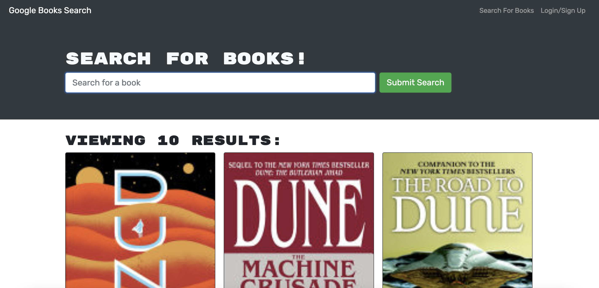

# Homework 21 - MERN Book Search

## Description

This is a React application which allows a user to search for a book and view search results.

This Google Books API search engine is built with GraphQL API and Apollo Server. This app was built with the MERN stack with a React frontend, Mongo database, and Node.js/Express.js server and API.

Upon initial load, the application displays a header and a search input with a green search button. Large text prompts the user to enter a book title, hit return or click the button, and results matching the search term will appear below.

There is also a login in and sign up option in the navigation bar. This functionality allows users to sign up, create an account, and save book searches to the backend.

## Installation

This is a React application. It requires an "npm i" to install node modules and update the package-json. It also requires an "npm run build" to pack the files within the react app. This ensures quicker load times for users due to its lighter framework.

To run this application from the command line type "npm run start". The React app will automatically pull up the application.

## Screenshot

## License

This application is covered under an MIT License.

## Contact Me

GitHub: https://github.com/heatherveva

Email: heatherveva@gmail.com

## Links

GitHub Repository: https://github.com/heatherveva/hw21MERN.git

GitHub Page: https://heatherveva.github.io/hw21MERN/
